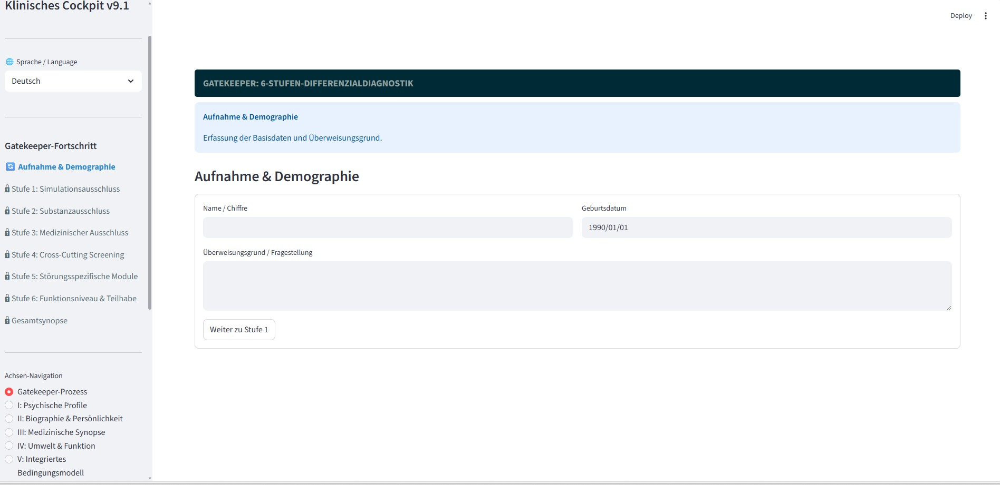

# Multiaxial Diagnostic Expert System (V10)

[](https://doi.org/10.5281/zenodo.18736725)

A computer-assisted 6-axis psychiatric diagnostic system integrating DSM-5-TR, ICD-11, and ICF in a unified expert system.

> **For qualified mental health professionals only.** This tool supports but does not replace clinical judgment.



## Overview

This system addresses the structural gap left by the abolition of the multiaxial system in DSM-5 (2013). It provides a comprehensive, multi-professional diagnostic framework with innovations that go beyond any previous classification system.

### The 6-Axis Model

| Axis | Name | Sub-axes | Primary Profession |
|------|------|----------|-------------------|
| I | Mental Health Profiles | Ia-Ij (10 sub-axes) | Psychologist / Psychiatrist |
| II | Biography & Development | Personality (PID-5), Education, IQ | Psychologist |
| III | Medical Synopsis | IIIa-IIIm (13 sub-axes, symmetric to Axis I) | Physician |
| IV | Environment & Functioning | ICF, WHODAS 2.0, GAF, GdB, CFI | Social Worker |
| V | Integrated Condition Model | 3P/4P Case Formulation | Interdisciplinary Team |
| VI | Evidence Collection & Clinical Safety | Evidence Matrix, CAVE Alerts, Symptom Timeline | All Professions |

### Key Innovations

- **Formal Coverage Analysis** (Ii/IIIi): Set-based metric C(S) = |explained| / |total symptoms| plus percentage-based symptom-diagnosis matrix identifying unexplained symptoms
- **Symmetric Axis I/III Architecture**: Identical structural tools for psychologists and physicians
- **PRO/CONTRA Evidence Evaluation**: Structured evidence for/against each diagnosis with confidence estimation
- **CAVE Clinical Alerts**: Cross-axis risk management (drug interactions, lab artifacts, contraindications)
- **Prioritized Investigation Plan**: 3-tier system (Urgent / Important / Monitoring)
- **Longitudinal Symptom Timeline**: Tracking onset, status, and therapy response over time
- **HiTOP Spectra**: Automatically computed from Cross-Cutting screening results
- **6-Step Gatekeeper Logic**: Implementing First's (2024) gold-standard differential diagnosis sequence
- **11 Disorder Modules**: Complete screening-to-diagnosis coverage via hierarchical state machine

## Scientific Paper

The theoretical foundation and clinical rationale for this system are described in the accompanying preprint:

> **Geiger, L.** (2026). *An Integrated Multiaxial Model for Computer-Assisted Psychiatric Diagnosis: Synthesis of DSM-5-TR, ICD-11, and ICF in a 6-Axis Expert System.* Zenodo. [https://doi.org/10.5281/zenodo.18736725](https://doi.org/10.5281/zenodo.18736725)

The preprint is available in English, German, and a combined bilingual edition:
- [`paper/Review_Multiaxiale_Diagnostik_v2_en.pdf`](paper/Review_Multiaxiale_Diagnostik_v2_en.pdf) -- English
- [`paper/Review_Multiaxiale_Diagnostik_v2_ger.pdf`](paper/Review_Multiaxiale_Diagnostik_v2_ger.pdf) -- German

### Security & Quality (V10)

- **XSS Protection**: All user-supplied data HTML-escaped before rendering
- **GAF Deprecation Notice**: DSM-5 replaced GAF with WHODAS 2.0; system shows deprecation warning
- **Professional-Use Disclaimer**: Sidebar warning for qualified personnel only
- **Robust Input Parsing**: Likert scale extraction with fallback handling
- **Full Bilingual Coverage**: All UI strings (584 keys DE/EN) via `translations.json`, no hardcoded strings

## Tech Stack

- **UI**: Streamlit
- **Decision Engine**: `transitions` (Hierarchical State Machine)
- **Visualization**: Plotly (PID-5 + HiTOP radar charts)
- **Data Validation**: Python dataclasses
- **Internationalization**: Bilingual (German/English) via `translations.json` (584 keys per language)

## Installation

```bash
pip install streamlit plotly pandas transitions anytree
```

## Usage

```bash
streamlit run _data/multiaxial_diagnostic_system.py
```

## Project Structure

```
paper/                                       # Scientific preprint (EN + DE + .bib)
_data/multiaxial_diagnostic_system.py        # Main application (V10, ~2690 lines)
_data/translations.json                      # Bilingual i18n (661 keys DE/EN)
_data/build_code_database.py                 # Diagnostic code database builder
_data/diagnostic_codes.db                    # Pre-built code database (ICD-11/DSM-5-TR/ICF)
_data/requirements.txt                       # Python dependencies
_results/Konzept_Dimensionale_Integration.md # Dimensional integration concept (DE)
_results/Ausbauplan_Prototyp_V9.md           # Development roadmap (DE)
_archive/                                    # Previous versions (v1, kombi)
```

## Development Roadmap

See [Ausbauplan_Prototyp_V9.md](_results/Ausbauplan_Prototyp_V9.md) for the full roadmap.

**Completed (Sprint 1 / V9 + V9.1):**
- Ii/Ij swap (coverage before investigation)
- HiTOP spectra from Cross-Cutting data
- Symmetric Axis III (13 sub-axes)
- PRO/CONTRA evidence evaluation with confidence
- Formal + quantitative coverage analysis with metrics
- Prioritized investigation plan (3-tier)
- CAVE clinical alerts
- Longitudinal symptom timeline
- Extended medication form (IIIm)
- Full JSON export
- XSS protection (html escaping)
- WHODAS 2.0 domain score persistence
- GAF deprecation notice
- Professional-use disclaimer
- Full i18n coverage (no hardcoded strings)
- Robust Likert scale parsing

**Completed (Sprint 2 / V10):**
- Axis V P1-P4 structured coding (source axis + evidence level per factor)
- Pathophysiological causal model (genetic-neurobiological / psychological-developmental / environmental-situational)
- Therapy resistance tracking (treatment attempts, response rates, switch reasons)
- CGI-S / CGI-I outcome parameters with longitudinal tracking
- Session auto-save / data persistence (JSON-based save & load)

**Next (Sprint 3):**
- Multi-professional role model (login/role-based axis access)
- Automated coverage analysis (cross-cutting to diagnosis mapping)
- Comorbidity rules (automated warnings)
- HSM disorder modules (11 structured modules)

## Citation

If you use this system in your research, please cite:

```bibtex
@article{geiger2026multiaxial,
  title={An Integrated Multiaxial Model for Computer-Assisted Psychiatric Diagnosis},
  author={Geiger, Lukas},
  year={2026},
  doi={10.5281/zenodo.18736725},
  publisher={Zenodo}
}
```

## License

CC-BY 4.0. See [LICENSE](LICENSE) for details.

## Author

**Lukas Geiger** -- Independent Researcher, Bernau im Schwarzwald, Germany

*AI-assisted development: Claude Opus 4.6 (Anthropic), Gemini (Google DeepMind), Copilot (Microsoft)*
